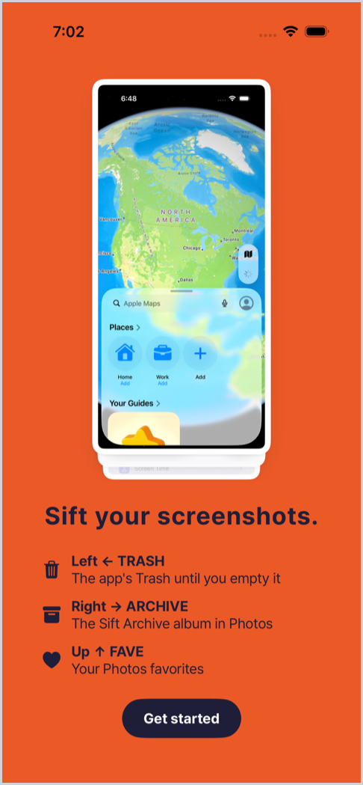
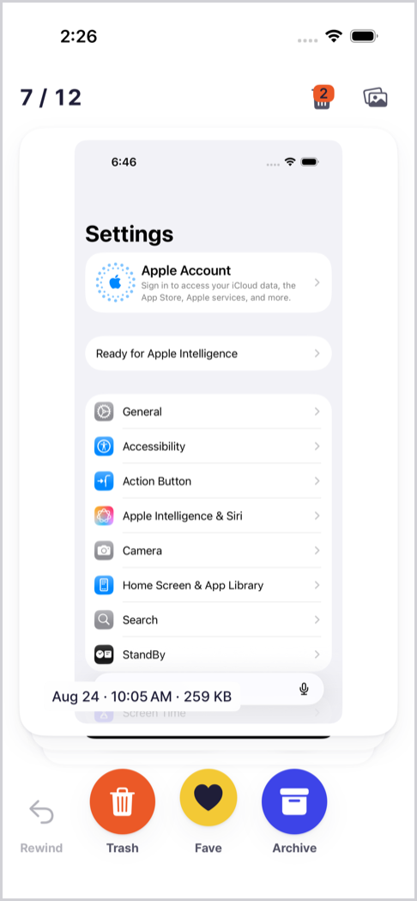
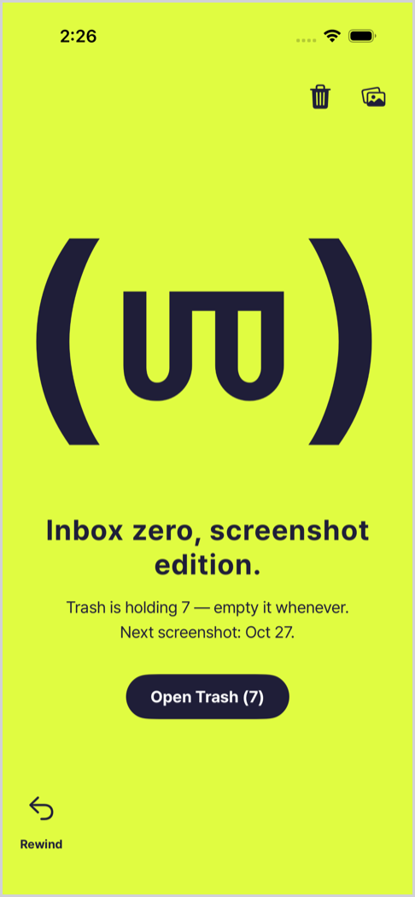
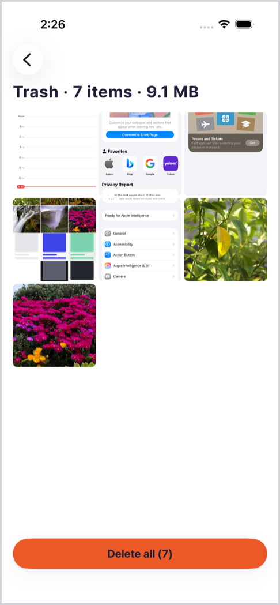
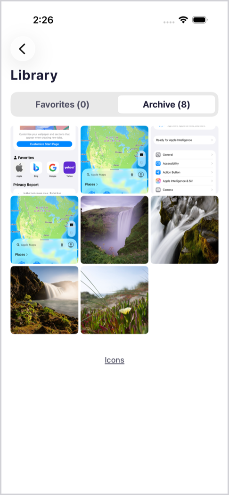

# Sift

Sift is an iOS 17 app that turns your Photos screenshots into a card stack you sort with a swipe.

<p align="center">
  
  
  
  
  
</p>

**How it works**

- Swipe left to send a screenshot to Trash, the app's own holding pen.
- Swipe right to Archive it in the "Sift Archive" album in Photos, or up to Favorite it (Photos' heart).
- One-step rewind takes back your last swipe.
- Only screenshots taken 30 or more days ago are asked about; newer ones join once they reach 30 days.
- Nothing leaves Photos until you empty Trash, and iOS asks you to confirm every permanent delete.

Course project for IXD 750 Product Innovation, Academy of Art University, 2026.

**On the web:** [Design system](https://heejae92.github.io/Sift/design-system.html) · [Information architecture](https://heejae92.github.io/Sift/ia.html)

This repository holds the app (SwiftUI, Swift 6, no third-party code), its design system, the
information architecture and the architecture document; the name Sift is provisional (ADR-002).
Swift is canonical for the design system (ADR-001): every token value is typed once under
`Sift/DesignSystem/`, and one script derives the CSS variables, the WCAG contrast table and the
name lint from it. The app consumes those tokens and nothing else (P-12).

## File map

| Path | What it is |
|---|---|
| `project.yml` | The XcodeGen spec. `Sift.xcodeproj` is generated from it and git-ignored (ADR-026) |
| `Sift/SiftApp.swift`, `Sift/Navigation/` | Entry point, the route enum, and the root gate that shows Permission, the limited interstitial, or the app's navigation stack |
| `Sift/Data/` | `Screenshot`, `Verdict`, the JSON store, `ReviewPolicy` (only screenshots at least 30 days old are reviewed, ADR-032), and `Catalog`: the one source of truth, which derives the queue instead of storing it (ADR-025) |
| `Sift/Services/` | The `PhotoLibrary` protocol, its PhotoKit implementation, the image loader, and the system UI hooks |
| `Sift/Components/` | Shared views: buttons, color blocks, empty states, the thumbnail cell, the toast |
| `Sift/Features/` | One folder per screen: Review, Permission, Trash, Library, Viewer, Credits |
| `Sift/DesignSystem/*.swift` | The nine token files. The only place a design value is typed; a product rule's constant lives in `Sift/Data/` under the ADR that set it (`ReviewPolicy`, ADR-032) |
| `Sift/Resources/` | The asset catalog, the four Pretendard cuts with their license (`Fonts/Pretendard-OFL.txt`), and six sample screenshots (real iOS screens captured with `SiftUITests/SampleCaptureTests`) used by the demo stack and as the simulator seed |
| `Sift/PrivacyInfo.xcprivacy` | Privacy manifest: no tracking, no collection, no required-reason APIs |
| `SiftTests/` | Swift Testing suites, with an actor fake for Photos and an in-memory store, plus the opt-in sample seed tool (`SampleSeedTests`) |
| `SiftUITests/` | XCTest UI tests: the screenshot tour (`SiftTourTests`) and the opt-in sample capture tool (`SampleCaptureTests`) |
| `docs/knowledge/ARCHITECTURE.md` | Stack, module map, data flow, the deck state machine, concurrency rules, build order |
| `docs/knowledge/UI_DESIGN.md` | The design system: tokens, components, screens, the generated contrast table |
| `docs/knowledge/IA.md` | The information architecture: objects, screens, navigation, routing, the queue lifecycle, persistence, external change. ADR-025, confirmed 2026-09-27; the 30-day rule, ADR-032, 2026-09-28 |
| `docs/knowledge/DESIGN_PRINCIPLES.md` | P-01 to P-23, the rules a review cites |
| `docs/knowledge/PRINCIPLES_CHECKLIST.md` | 27 lines for the 23 principles (P-19 gets four, P-15 gets two), plus a pre-ship list for a screen |
| `docs/knowledge/DECISIONS.md` | ADR-001 to ADR-033, plus the superseded decisions S-1 to S-4 |
| `docs/superpowers/specs/2026-09-23-sift-design-system-design.md` | The design spec behind the design system |
| `docs/references.md` | Reference boards, the format reference, three Lazyweb permission-screen links |
| `docs/screenshots/` | The simulator frames shown at the top of this README, exported from the screenshot tour and downscaled with `sips --resampleWidth 480` |
| `design-system.html` | Single-file living style guide with a working swipe demo |
| `ia.html` | The information architecture as diagrams: object model, screen map, launch routing, queue state machine |
| `scripts/ds_tokens.py` | `contrast`, `emit-css`, `lint`. Standard library only |
| `scripts/typecheck-ds.sh` | Type-checks the token files without an Xcode project |
| `scripts/out/` | Generated output. Git-ignored; the copies that matter are pasted into the documents |

Every count in that table is derived rather than remembered, because a count in prose goes stale the
moment the file it describes grows. Re-derive them, and replace the figures here with what they
print:

```
ls Sift/DesignSystem/*.swift | wc -l                        # token files, 9
grep -c '^## ADR-' docs/knowledge/DECISIONS.md              # ADRs, 33
grep -o '^## ADR-[0-9]\{3\}' docs/knowledge/DECISIONS.md \
  | tail -1                                                # highest ADR, ## ADR-033
grep -c '^### S-' docs/knowledge/DECISIONS.md               # superseded entries, 4
grep -c '^\*\*P-' docs/knowledge/DESIGN_PRINCIPLES.md       # principles, 23
grep -c '^- \[ \] P-' docs/knowledge/PRINCIPLES_CHECKLIST.md # principle checklist lines, 27
```

The figures after each `#` are what those commands printed on 2026-09-28, run from the repository
root. The ADR range in the table above comes from the second and third of them: the log runs
ADR-001 to ADR-033 with no gaps, and S-1 to S-4 alongside.

## Building the app

XcodeGen produces the project; Xcode builds it. On this machine `xcode-select` points at the
Command Line Tools, which have no iOS SDK, so every `xcodebuild` call names Xcode through
`DEVELOPER_DIR`. Run from the repository root:

```
xcodegen generate
DEVELOPER_DIR=/Applications/Xcode.app/Contents/Developer xcodebuild -project Sift.xcodeproj -scheme Sift -destination 'platform=iOS Simulator,name=iPhone 17' build
DEVELOPER_DIR=/Applications/Xcode.app/Contents/Developer xcodebuild -project Sift.xcodeproj -scheme Sift -destination 'platform=iOS Simulator,name=iPhone 17' -only-testing:SiftTests test
```

The last line ends with `** TEST SUCCEEDED **` and, a few lines above it, the Swift Testing summary
with the number of tests that ran. The UI tests are left out on purpose: the screenshot tour needs a
seeded, granted simulator and has its own command below. Generate again after adding or removing a source file; the
project is not committed (ADR-026).

## Running on the simulator

A simulator cannot take screenshots into its Photos library, and its stock photos are not
screenshots, so a DEBUG simulator build accepts the launch argument `-SiftAllImages` and reviews
every image instead (ADR-027). The six sample screenshots under `Sift/Resources/SampleScreenshots/`
are the seed set:

```
export DEVELOPER_DIR=/Applications/Xcode.app/Contents/Developer
xcrun simctl boot "iPhone 17"
xcrun simctl addmedia booted Sift/Resources/SampleScreenshots/sample-*.png
xcrun simctl install booted <path to Sift.app from the build above>
xcrun simctl launch booted com.heejaeeo.sift -SiftAllImages
```

Grant access in the app when it asks. Running from Xcode (the ▶︎ button, any simulator) needs no
setup: the `Sift` scheme passes `-SiftAllImages` on Run, and a simulator's stock photos then show
up as cards.

Review asks only about screenshots at least 30 days old (ADR-032), and the seeded images are
recent: Photos dates each one from its file, 2026-09-27 for the current set. So they wait. The deck
shows the stock photos, which are years old and not screenshots, and once those are done the
all-done block names the day the first sample comes due ("Next screenshot: Oct 27.").

To see real screenshots as cards, seed the six samples a second time with old dates (ADR-033). The
seed tool is a hosted unit test, `SiftTests/SampleSeedTests`, that a normal test run skips. It is
compiled into simulator builds only, so a test build for a device does not contain it. It writes
with the app's own Photos access, so the order on a fresh or erased simulator is: `simctl addmedia`
(above), then grant access (the tour's first run, or Get started → Allow Full Access in the app),
then the seed tool, then the tour. The seed step is:

```
TEST_RUNNER_SIFT_SEED_SAMPLES=1 DEVELOPER_DIR=/Applications/Xcode.app/Contents/Developer xcodebuild -project Sift.xcodeproj -scheme Sift -destination 'platform=iOS Simulator,id=<UDID>' -only-testing:SiftTests/SampleSeedTests test
```

It adds the six bundled samples to Photos with fixed creation dates between 2026-08-01 and
2026-08-24, 35 to 58 days before 2026-09-28, so they are due and stay due. The copies from
`simctl addmedia` stay recent, which keeps the all-done line. A second run finds every date already
in the library and adds nothing. Without full access the test fails and says how to grant it.

To review freshly seeded images now instead, add `-SiftMinimumAgeDays 0`, or any whole number of
days:

```
xcrun simctl launch booted com.heejaeeo.sift -SiftAllImages -SiftMinimumAgeDays 0
```

From Xcode, add it under Product › Scheme › Edit Scheme › Run › Arguments. That edit lives in the
generated project, so the next `xcodegen generate` drops it; `project.yml` deliberately does not
carry it, so a simulator shows the real rule by default. The unit tests ignore it: they give the
catalog the 30-day rule themselves, because the Test action runs with the Run action's arguments.
Both arguments are read only by a DEBUG build on a simulator. A release build, and any build for a
device, a Debug run from Xcode on an iPhone included, ignores both.

Two things the machine may get wrong. If more than one device is named "iPhone 17", pass the
device by id (`-destination 'platform=iOS Simulator,id=<UDID>'` from `xcrun simctl list devices`),
because `name=` picks whichever one Xcode prefers. And `xcrun simctl privacy grant photos` does not
satisfy the app's access prompt on recent runtimes: tap "Allow Full Access" in the dialog, or let
the screenshot tour do it.

The screenshot tour is `SiftUITests/SiftTourTests`: an XCUITest that grants access through the
system dialog, then walks Permission, Review (three swipes and a rewind), Trash, the viewer, the
purge sheet and Library, attaching a screenshot at each stop. Run it alone and export the pictures:

```
DEVELOPER_DIR=/Applications/Xcode.app/Contents/Developer xcodebuild -project Sift.xcodeproj -scheme Sift -destination 'platform=iOS Simulator,id=<UDID>' -only-testing:SiftUITests -resultBundlePath /tmp/sift-tour.xcresult test
DEVELOPER_DIR=/Applications/Xcode.app/Contents/Developer xcrun xcresulttool export attachments --path /tmp/sift-tour.xcresult --output-path /tmp/sift-tour
```

Start from an erased device (`xcrun simctl erase <UDID>`) when the prompt has already been answered
once; a denied answer cannot be reset from the command line there. An erase empties the library, so
seed both again in the order above: `simctl addmedia`, grant access, the seed tool, then the tour.

## Viewing the guide

The guide and the IA page are published with GitHub Pages from `main`: https://heejae92.github.io/Sift/design-system.html and https://heejae92.github.io/Sift/ia.html. Every push to `main` republishes them. Locally, run `open design-system.html`, or serve the folder with `python3 -m http.server` and open
`http://localhost:8000/design-system.html`. It is one file with inline CSS and JavaScript and needs
no build step.

## Design-system commands

Four commands, and they are the whole verification set for the tokens. Changing a token means
running all four, because `lint` compares the `:root` block pasted into the guide against fresh
`emit-css` output.

| # | Command | Expected output |
|---|---|---|
| 1 | `python3 scripts/ds_tokens.py contrast` | ends with `43 pairs · 0 failure(s)`, and no `OUT OF sRGB GAMUT` note in the token table |
| 2 | `python3 scripts/ds_tokens.py emit-css > scripts/out/tokens.css` | writes the `:root` block; paste it into `design-system.html` |
| 3 | `python3 scripts/ds_tokens.py lint` | one `lint: EXCEPTION` line per `DECLARATION_ONLY` entry, one `lint: WARNING` line, then `lint: OK` |
| 4 | `scripts/typecheck-ds.sh` | `typecheck: OK` |

The 43 contrast pairs are 40 enforced plus 3 informational rows: the yellow edge against `canvas`,
the same edge against a white screenshot, and the raised fill against `canvas`. Two of the 40 carry
the label on a color block's call-to-action pill, which is why the table grew from 41 pairs: the
pill is filled with the block's own ink (`DSBlock.ctaFill`) and labelled with that ink's counterpart
(`DSBlock.ctaLabel`), so the pill against the block is the same pair as the block's copy and needed
no row of its own. `DSBlock.focusRing` is the same ink at full strength and needs no row for the
same reason (ADR-023).

The guide renders both directions of that pill. `.btn--onblock` is the navy pill with a white label,
which is what six of the seven blocks take; `.btn--onblock-inverted` is the white pill with a navy
label, which `violet` takes, because `violet` is the one block whose ink is white. A block carries
one filled action and no more: the second action is `.btn--onblock-text`, bare text in the block's
ink. A filled secondary would be a shape, and a shape owes 3:1 against what it sits on, which on
blocks means a row per fill rather than one row. `surfaceRaised` does not have those rows: it
measures 2.16 against `lavender` and clears the bar on `violet` alone. Bare text is not a shape, so only its
label is measured, and the label is the pair the block's own copy row already clears.

`lint`'s EXCEPTION lines, ten on 2026-09-28 (`python3 scripts/ds_tokens.py lint | grep -c 'lint: EXCEPTION'`),
cover `--grid-breakpoint`, `--motion-dur3`, `--motion-toast-visible`,
`--motion-confetti`, `--motion-stagger`, `--size-viewer-zoom-double-tap`, `--size-viewer-zoom-max`,
`--motion-demo-card`, `--motion-demo-pause` and `--size-block-face-share` — variables the guide declares but has no way to
consume, each allowlisted with a reason (ADR-022, ADR-028, ADR-030). They are the `DECLARATION_ONLY` entries printing themselves and their
recorded reason on every run, rather than being tolerated in silence. The WARNING line stands while
`DSIconCredits.entries` is empty, and it is a warning: it does not change the exit code. Both are
expected output; the verdict is the last line.

`lint` counts a variable as used by **exact name, outside comments**. It strips `<!-- ... -->` from
the HTML first, then matches each name with a trailing-character guard and requires two occurrences,
the declaration in the generated `:root` block plus at least one real use. So a variable named only
inside an HTML comment counts as unused, and `--color-ink` is never satisfied by `--color-ink-muted`.
The module docstring at the top of `scripts/ds_tokens.py` states the same three rules.

## Notes

**The parent folder name begins with a space.** Quote every path in every command and script.
`ds_tokens.py` resolves its own paths relative to its file, so it is unaffected; a shell command
that spells the path out is not.

**The remote is `https://github.com/Heejae92/Sift`, public.** The global git configuration on
the machine that created it rewrites every GitHub push to SSH (`url.git@github.com:.pushInsteadOf`)
and the machine has no SSH key, so this clone carries a repository-local identity `pushInsteadOf`
for its own URL, which wins by being the longer match and keeps pushes on HTTPS through the `gh`
credential helper. It is local configuration, not a file in the repository; a fresh clone on a
machine with an SSH key needs nothing.

**Forager Bold Overlap is not licensed for the app yet.** The display face is Forager Bold Overlap
(Mark Simonson Studio), and Adobe Fonts covers web and desktop use, not embedding in a mobile app.
Until an app license exists the display roles fall back to Pretendard Bold at runtime. Forager
Overlap has no cut heavier than Bold, so `DSFont.displayBold` and `DSFont.displayBlack` both resolve
to `Forager-BoldOverlap` and the fallback is all-or-nothing: either the one face is bundled or
`display`, `headline`, `title` and `stamp` all render Pretendard Bold. The probe behind that is
`DSFont.availableDisplayNames`, a `Set` built by checking each PostScript name on its own, so the
two identical names collapse instead of colliding and a later split of the family still falls back
per cut. The guide loads the face from Typekit kit `blt4ith`, family `forager-overlap`, weights
**400 and 700** — there is no heavier cut, so every display role is set at 700 on the web.

Because Forager Overlap's strokes intentionally run into each other, the display roles are tracked
**out**: `DSTextRole.tracking` returns 34 × 0.03, 28 × 0.03 and 24 × 0.03 pt for `display`,
`headline` and `title`. `stamp` is the fourth display role, and it is tracked as a flat +2 pt
rather than as a fraction of its size, because its size is not fixed: it is set uppercase at
`DSTextRole.stampBaseSize` (32) and clamped at `stampMaxSize` (44). The Pretendard roles keep their
own tracking.

**Pretendard is licensed under the SIL Open Font License 1.1**; the license text,
`Sift/Resources/Fonts/Pretendard-OFL.txt`, ships next to the fonts and inside the app bundle, as the
license requires.

**Bump the guide's `?v=` when the Typekit kit changes.** Typekit serves kit CSS with `max-age=600`,
so an edit to the kit does not reach the page for ten minutes. `design-system.html` loads
`https://use.typekit.net/blt4ith.css?v=2`; raising that number is what makes a kit change visible.

**The guide's Reduce Motion block excludes the deck on purpose.** The system substitutes two
animations under Reduce Motion rather than deleting them, so the blanket
`prefers-reduced-motion` rule in `design-system.html` skips `.deck__card` and its children through
`:not(:where(...))`; without that carve-out the `.01ms !important` cut would replace the
substitutions the demo exists to show. `revert-layer` is not a substitute for the exclusion: with no
cascade layers declared it rolls back to the UA value of 0 s, the same instant cut.

**The Noun Project icons are not downloaded yet.** `DSIconCredits.entries` is empty, so the credits
screen reports that no third-party icons ship, and each icon renders its SF Symbol development
fallback. Each icon's search query is listed in `UI_DESIGN.md` §8; adding an asset and adding its CC
BY credit line belong in the same commit.
