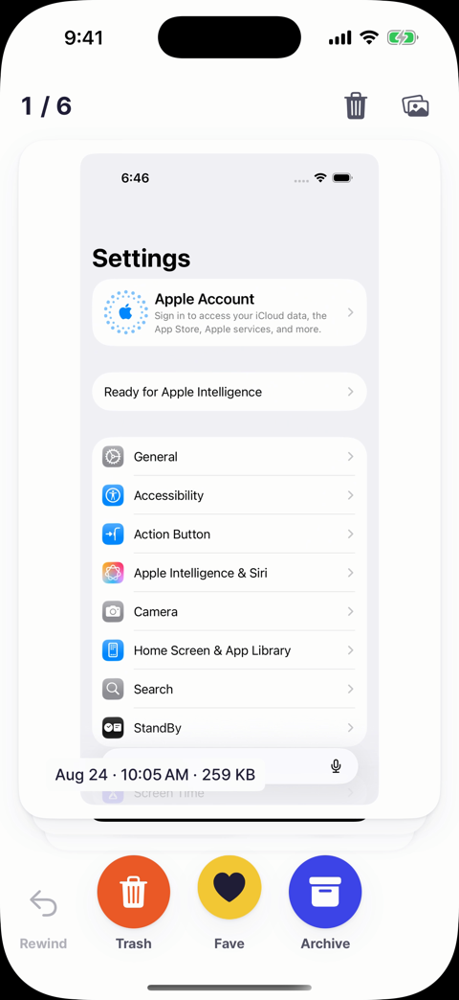

# Sift

Sift helps you clear out old screenshots, one swipe at a time.

  
  
  
  
  

## The problem

I take a lot of screenshots, like tickets, recipes, maps and chats, and rarely look at them again. They pile up in Photos, and my phone is always short on storage. Clearing them out needs to happen regularly, but in Photos it means scrolling through everything and deleting screenshots one by one, so it keeps getting put off.

What I needed was a way to gather only the screenshots I'm done with, usually the ones older than about a month, and quickly set aside the ones to delete.

## The solution

Sift turns clearing out screenshots into a quick, regular habit instead of a chore.

- **It only asks about old screenshots.** Screenshots taken 30 or more days ago are the ones you're most likely done with. Sift gathers those and leaves everything else alone: your photos, and recent screenshots you may still need. A newer screenshot joins by itself once it turns 30 days old.
- **Deciding takes one swipe.** Screenshots come one at a time as full-size cards, so you can see what each one is and decide in a second.
- **Deleting happens once, at the end.** Screenshots you swipe away collect in Sift's Trash instead of disappearing right away. Trash shows how much storage they use, and you delete them all at once when you're ready.
- **Nothing is lost by mistake.** Rewind takes back the last swipe, anything in Trash can be restored, and deleted screenshots stay in Photos' Recently Deleted for 30 days.

## How it works

  <video src="docs/demo/sift-demo.mp4" poster="docs/demo/sift-demo-poster.png" width="280" controls muted playsinline>
    
  </video>

Demo, about 70 seconds, no sound: onboarding, three swipes and a rewind, all done, Trash, Library.

1. **Start.** A short demo shows the three swipes. Tap Get started and allow access to Photos. Nothing leaves your phone.
2. **Sift.** Each card is a screenshot from 30 or more days ago, newest first. Swipe left to Trash, right to the "Sift Archive" album, or up to Favorites. Tap Rewind to undo the last swipe.
3. **Finish.** When the pile is empty, Sift says so and tells you when the next screenshot will be ready.
4. **Empty Trash.** Trash shows how many screenshots are waiting and how much space they use. Delete them all at once, or restore any you want to keep. iOS asks you to confirm.
5. **Find what you kept.** Library has two tabs, Favorites and Archive.

---

Course project for IXD 750 Product Innovation, Academy of Art University, 2026.

**More:** [Design system](https://heejae92.github.io/Sift/design-system.html) · [Information architecture](https://heejae92.github.io/Sift/ia.html) · [Developer notes](https://github.com/Heejae92/Sift/blob/main/docs/DEVELOPMENT.md)
